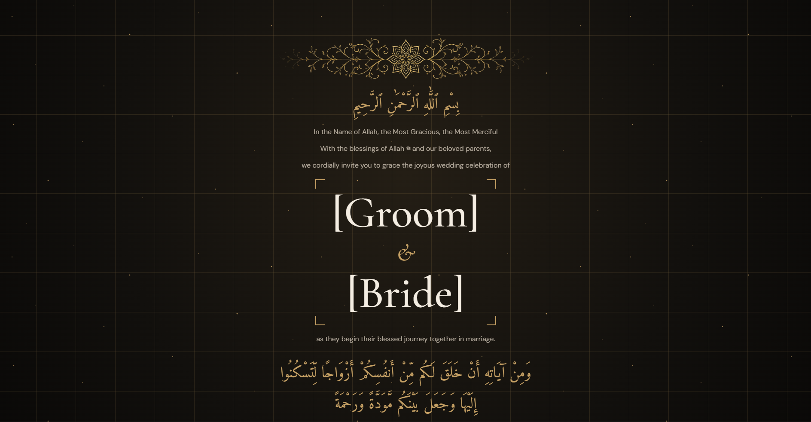
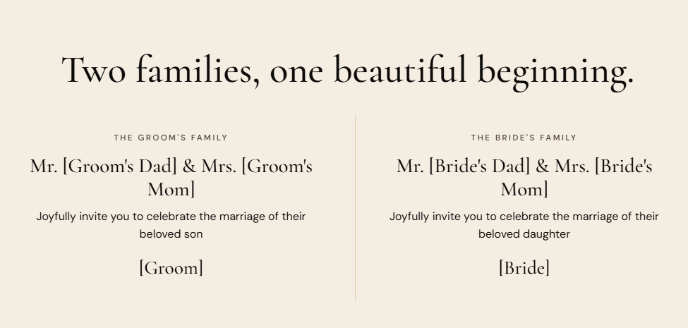
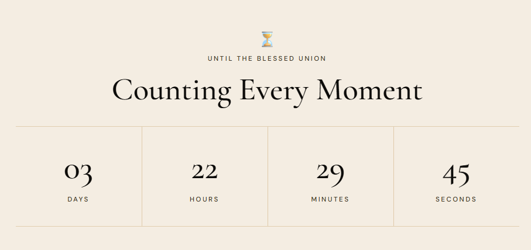
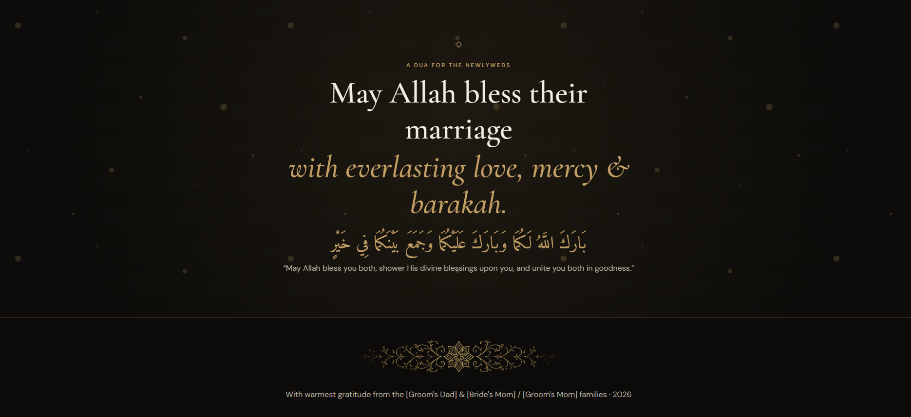

# Wedding Invitation

A single-page React invitation. Names, families, the program, the venue, prayers, colors, and images all come from [`src/data/wedding.json`](src/data/wedding.json), so the same site can be reused for another couple by editing that file and replacing the images.

## Screenshots

### Opening

The page opens with the Bismillah, the couple's names inside gold corner marks, and a verse on the dark grid.



### Families

Both families sit side by side on a cream band, with the parents' names and the couple filled in from the JSON file.



### Countdown

An hourglass and a ruled row count the days, hours, minutes, and seconds until the ceremony.



### Closing

The final dua sits on the patterned dark field, with the blessing in Arabic and English.



## What guests can do

- Read the opening, both families, the nikah and reception, the venue, a countdown, and a closing dua.
- Share the page. If the browser has no share sheet, the page address is copied instead.
- Open the venue in Google Maps, or copy the address.
- Add the nikah to Google Calendar, or download an Apple / Outlook `.ics` file. Times are India time (`GMT+5:30`) and sent to calendar apps in UTC.

Write a date as `DD-MM-YYYY`, such as `24-10-2026`, and a time as `11:30AM`. Every time is India time, GMT+5:30. The countdown and calendar use `date`, `time`, `endDate`, and `endTime` on `calendar`. A clock time is shown with the weekday, such as `Saturday · 11:00 AM`. Other wording, such as `Following the Nikah`, is shown as written. A date or time that cannot be read leaves the countdown at zero, shows the time as written, and turns off the calendar buttons. After the ceremony starts, the countdown stays at zero. Sections fade in as they scroll into view, and they appear immediately when the guest prefers reduced motion.

## Change it for another client

Edit `src/data/wedding.json`.

| Section                           | What to change                                                                  |
| --------------------------------- | ------------------------------------------------------------------------------- |
| `opening` names                   | `groom`, `bride`, `groomDad`, `groomMom`, `brideMom`, and `brideDad`            |
| `title`, `shareMessage`, `footer` | Browser title, share text, and closing line                                     |
| `brand`                           | Ornament, favicon, Apple touch icon, and the social share image                 |
| `opening`                         | Bismillah, invitation lines, and the verse                                      |
| `families`                        | Parents and the invitation lines                                                |
| `celebration`, `events`           | Program cards. Each event has `number`, `eyebrow`, `title`, `time`, and `place` |
| `venue`                           | Address lines and the Google Maps URL                                           |
| `calendar`                        | Event title, start, end, details, and location                                  |
| `closing`                         | The final dua                                                                   |
| `theme`                           | `bg`, `surface`, `text`, `muted`, and `accent` as hex colors                    |

Those five theme colors are applied as CSS variables before the first paint. Light bands, such as the families and countdown, reuse the same colors.

`{GroomName}`, `{BrideName}`, `{Groom's Dad}`, `{Groom's Mom}`, `{Bride's Mom}`, and `{Bride's Dad}` in any sentence are replaced from those `opening` fields. `{Year}` becomes the current calendar year. The title, share text, family cards, calendar event, and footer use these tokens. Rewrite a sentence whenever you want, and leave a token out of a sentence that should stay exactly as written.

Image files live in `public/`:

- `public/images/ornament.png` — floral divider
- `public/images/share.jpg` — generic image used when the link is shared
- `public/favicon.jpg` — browser tab icon
- `public/apple-touch-icon.jpg` — home-screen icon

These pictures stay the same for every invitation. Names, the date, and the venue come from `wedding.json`, so a new client does not need a new favicon.

Keep the same filenames, or change the paths in `brand` to match the new files.

## Scripts

```bash
npm install
npm run dev
```

| Command                | What it does                                          |
| ---------------------- | ----------------------------------------------------- |
| `npm run dev`          | Starts the Vite dev server                            |
| `npm run build`        | Writes the production site to `dist/`                 |
| `npm run preview`      | Serves the production build                           |
| `npm test`             | Runs the Vitest suite once                            |
| `npm run lint`         | Runs ESLint, including import order and import groups |
| `npm run typecheck`    | Checks the TypeScript types without emitting files    |
| `npm run format`       | Formats the project with Prettier                     |
| `npm run format:check` | Fails if any file would be rewritten                  |

Prettier uses single quotes, no semicolons, and trailing commas. Imports are grouped with a blank line between groups: Node built-ins, packages, internal aliases, relative files, then stylesheets. Within a group they are alphabetical.

## Checks

Two GitHub Actions workflows run on every push and pull request:

- [Lint](.github/workflows/lint.yml) runs Prettier, ESLint, and the TypeScript check.
- [Test](.github/workflows/test.yml) runs the Vitest suite.

`npm install` installs a Git pre-commit hook. The hook formats staged files with Prettier and applies every ESLint rule, including import order. A commit stops when a staged file still breaks either check.

## Layout

```text
src/
  data/wedding.json          Invitation content and theme
  components/                Opening, families, program, venue, countdown, closing
  components/__tests__/      Tests for those sections
  lib/calendar.ts            Copy, Google Calendar link, and .ics download
  lib/__tests__/             Tests for the calendar helpers
  __tests__/                 Tests for the full page
  test/                      Vitest setup
  types.ts                   Types derived from the invitation JSON
  styles.css                 Layout, motion, and theme variables
  App.tsx                    Composes the page from the JSON file
public/                      Logo, ornament, share image, and icons
```

The app is Vite with React and TypeScript. Tests use Vitest and Testing Library.
